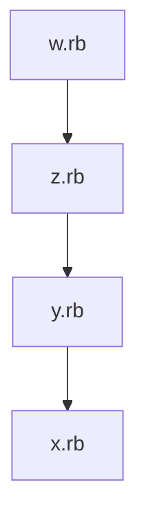

a) Erkläre die Unterschiede zwischen den Methoden require, load und require_relative in Ruby. Beschreibe, wie sie in der Praxis angewendet werden, um Code aus verschiedenen Dateien in ein Ruby-Projekt einzubinden.

require: Lädt eine Datei (z.B. eine Bibliothek) nur einmal. Sucht im $LOAD_PATH. 
Beispiel:
```ruby
# Lädt die json-Bibliothek nur einmal
require 'json'
```

load: Lädt und führt eine Datei jedes Mal aus, wenn load aufgerufen wird. Pfad muss meist explizit angegeben werden. 
Beispiel:
```ruby
# Lädt und führt die Datei jedes Mal aus
load './meine_datei.rb'
```

require_relative: Wie require, aber der Pfad ist relativ zur aktuellen Datei. 
Beispiel:
```ruby
# Lädt Datei relativ zum aktuellen Speicherort
require_relative 'utils/helper'
```

b) Erstelle ein Diagramm, das die Beziehungen zwischen vier hypothetischen Ruby-Dateien (x.rb, y.rb, z.rb und w.rb) darstellt, wobei jede Datei Code aus der vorherigen Datei einbindet.

Diagramm (Mermaid-Syntax):



c) Beschreibe, wie die Methode require_relative in diesem Kontext funktioniert und was passiert, wenn w.rb ausgeführt wird.

`require_relative` lädt die angegebene Datei relativ zum Speicherort der aktuellen Datei. Wird `w.rb` ausgeführt, lädt es `z.rb`, das wiederum `y.rb` lädt, das schließlich `x.rb` lädt. Jede Datei wird nur einmal geladen.

d) Erläutere das Konzept einer "Bibliothek" in der Programmierung und wie es in Ruby umgesetzt wird. Gib ein einfaches Beispiel für eine Ruby-Bibliothek und erkläre, wie sie in einem Ruby-Programm verwendet wird

Eine Bibliothek ist eine Sammlung von Funktionen, Klassen oder Modulen, die wiederverwendbaren Code bereitstellt. In Ruby werden Bibliotheken meist als Gems oder einzelne `.rb`-Dateien bereitgestellt.
# Beispiel für eine Ruby-Bibliothek:
```ruby
# Datei: math_tools.rb
module MathTools
  def self.add(a, b)
    a + b
  end
end
```

# Verwendung der Bibliothek in einem anderen Programm:
```ruby
require_relative 'math_tools'
puts MathTools.add(2, 3) # Ausgabe: 5
```


Man Kann Standardbibliotheken auch Erweitern:
Ein einfaches Beispiel könnte eine String-Erweiterungsbibliothek sein, die eine Methode `titleize` zur Klasse `String` hinzufügt. Diese Bibliothek könnte mit `require 'string_extensions'` in einem Ruby-Programm verwendet werden.

```ruby
# Datei: string_extensions.rb
class String
  # Wandelt einen String in Titel-Schreibweise um (jedes Wort wird großgeschrieben).
  def titleize
    gsub(/(\A|\s)\w/) { |letter| letter.upcase }
  end
end
```

Mit dieser Erweiterung habe ich die eingebaute Ruby-Klasse `String` um die Methode `titleize` ergänzt. Das ist eine Form der "Bibliothekserweiterung" (genauer: Monkey Patching).


